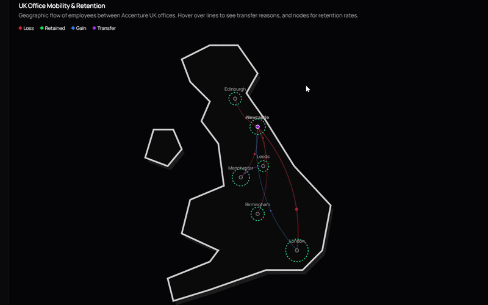

# National Innovation Centre for Data (NICD) – Accenture Retention Dashboard

## Project Overview
This project was developed during a Spring Week bootcamp hosted by the **National Innovation Centre for Data (NICD)**. Working in a team of six, we acted as external consultants for Accenture to address a critical business challenge: **quantifying and improving employee retention**.

We developed a internal dashboard designed to help Accenture’s HR and leadership teams move from reactive talent management to **proactive, data-driven strategy**.

---

## Business Challenge
High-performing organisations require a granular understanding of why talent leaves and which interventions actually work. Our brief was to create a tool that could:

- Quantify the success of existing retention campaigns  
- Identify geographical or departmental *"hotspots"* for turnover  
- Provide a **Minimum Viable Product (MVP)** that offers immediate strategic value  

---

## Methodology & Frameworks
To ensure the solution was grounded in business reality rather than purely technical analysis, we utilised several management consultancy frameworks:

- **Business Model Canvas**  
  Aligning the dashboard’s value with Accenture’s operational costs and revenue streams  

- **Value Proposition Canvas**  
  Mapping HR directors’ *pains* to the *relievers* provided by our insights  

- **Risk Analysis**  
  Identifying GDPR concerns and potential bias in turnover models  

- **MVP Approach**  
  Prioritising high-impact metrics for immediate stakeholder feedback  

---

## Professional Impact
This project demonstrates the ability to:

- Translate complex datasets into **actionable business intelligence**  
- Work effectively in a **multidisciplinary team** under tight deadlines  
- Apply **consultancy frameworks** to technical problems  

---

## Getting Started

To run this project locally:

```bash
# Clone the repository
git clone https://github.com/RyanDuong0/NICD-2026-Bootcamp

# Navigate into the project folder
cd NICD-2026-Bootcamp

# Install dependencies
npm install

# Start the development server
npm run dev
```

## Note
This repository contains an example version of the dashboard developed during the **NICD 2026 Bootcamp** for educational and demonstration purposes.
